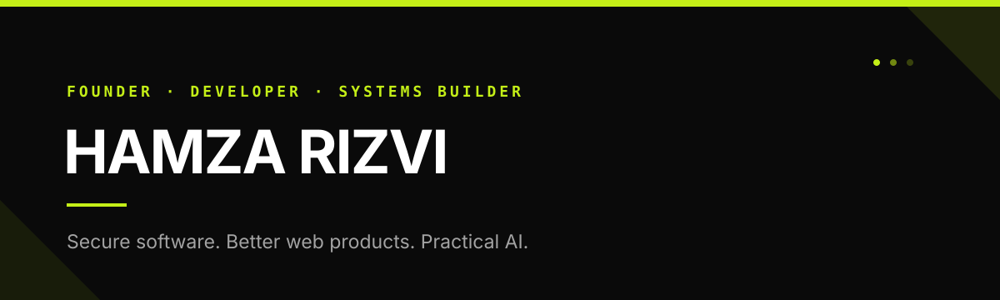

  

  
  
  

## About

I am the Founder and CEO of [Xsofty](https://xsofty.com), where I build high-performance websites, digital products, and practical automation systems. My work sits at the intersection of product engineering, web infrastructure, WordPress, AI tooling, and thoughtful interface design.

I care about security, maintainable architecture, measurable business outcomes, and software that earns its place in a real workflow.

## Current focus

- Building secure tools that connect WordPress with AI agents
- Developing native macOS utilities for better AI workflows
- Engineering high-performance web platforms with Next.js and TypeScript
- Designing internal systems for agency operations and product delivery

## Selected work

<table>
  <tr>
    <td width="50%" valign="top">
      <h3><a href="https://github.com/ihamzarizvi/xsofty-wordpress-mcp">Xsofty WordPress MCP</a></h3>
      
A security-first WordPress MCP bridge with 61 curated tools, least-privilege presets, approval controls, and private backups.

      
<code>PHP</code> <code>WordPress</code> <code>MCP</code> <code>Security</code>

    </td>
    <td width="50%" valign="top">
      <h3><a href="https://github.com/ihamzarizvi/SessionLimitTracker">Session Limit Tracker</a></h3>
      
A native macOS menu-bar app and edge rail for monitoring Claude, ChatGPT, and Gemini usage limits at a glance.

      
<code>Swift</code> <code>SwiftUI</code> <code>macOS</code> <code>AI tooling</code>

    </td>
  </tr>
</table>

## Technology

  
  
  
  
  
  
  
  
  
  
  

## GitHub activity

  

---

  Building useful systems with clarity, security, and intent.

